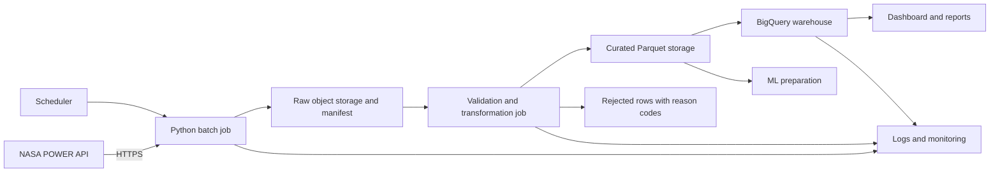

# HydroMet-ETL — Proposed Cloud Design

**Team:** JOVIN NJAU,DANIEL LAIZER,BAKARI MSHANA,MOHAMMED ALLY  
**Submission date:** 5OCTOBER2026  
**Architecture owner:** JOVIN

This is a proposed batch architecture for the same NASA POWER extract, not a deployed cloud refresh. The demonstrated historical BigQuery sandbox branch has 73,048 rows and 2,400 monthly aggregate groups, supported by inspected screenshots under `outputs/cloud/`. The other cloud components below remain proposed.

| Component / connection | Purpose and cost driver |
|---|---|
| Scheduler → batch job | Trigger frequency; scheduler operations and job invocations |
| API → job over HTTPS | Request count, retries, runtime and network transfer; do not assume API calls have a commercial fee |
| Job → raw storage | Serialized responses and manifest; storage bytes × retention, write operations and possible transfer charges |
| Raw storage → validation job | Reads, compute CPU/memory × duration and retries; align locations to reduce unnecessary transfer |
| Validation → curated storage | Parquet writes, stored bytes, versions and retention |
| Validation → quarantine | Rejected original rows/reasons; storage, writes and restricted review access |
| Curated storage → BigQuery | Load operations under chosen service mode, warehouse storage and cross-region transfer if applicable; verify applicable terms before deployment |
| BigQuery → dashboard/reports | Query bytes processed or reserved compute, refresh frequency, cached results, report tool licensing and exports |
| Curated storage → ML | Reads, feature-compute duration, feature artifacts and exports; no trained model is claimed |
| Jobs/warehouse → monitoring | Log/metric ingestion volume, retention, alert frequency and job metadata |
| Access to components | Managed identities, least privilege and secret-management operations; no embedded account credentials |

Select a consistent region, use managed identities and HTTPS, retain checksums and reject reasons, and gate analytical refresh on validation. Partitioning and clustering are proposals to test against query patterns, not proven current pruning. Source publication delay must inform refresh policy; archive coverage and refresh time are different.

Inspected query-editor screenshots estimate 7.04 MB for all columns and 1.74 MB for the selected-column query, about 75.3% lower. The latter also contains a date filter, so this is a combined query-design comparison rather than an isolated causal experiment on projection. No completed-job byte statistics, monetary invoice, live cloud automation or scheduler deployment is verified. Component costs depend on usage, region and current service terms; this design lists drivers without inventing prices.

This is a one-page-intended design; final page count remains to be checked in the submission format. See [longer architecture discussion](cloud_architecture.md) and [tracker](lab_requirements_tracker.md).