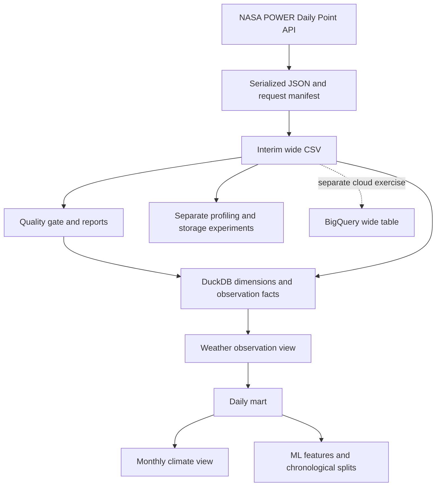

# HydroMet-ETL Data Lineage

Reviewed on 2026-10-04 against existing code and saved evidence. Dependencies below distinguish operational stages from separate experiments.

## Transformation register

| Stage | Input and transformation | Output and evidence |
|---|---|---|
| Ingestion | Request point data; validate parameters; serialize raw response; assemble and sort daily rows | `data/raw/nasa_power/*.json`; `data/interim/nasa_power_tanzania_daily.csv`; `metadata/ingestion_manifest.json`; `outputs/reports/ingestion_run_summary.json`; implementation `src/ingestion/ingest_nasa_power.py` |
| Profiling | Describe coverage, source diversity and distributions without modifying values | `outputs/reports/initial_data_quality_report.json` and `advanced_data_profiling_report.json` |
| Quality | Validate schema, completeness, keys, physical rules and dates; pool all locations/dates for each variable's IQR screening | `outputs/quality/data_quality_report.json` and `data_quality_summary.csv`; implementation `src/quality/validate_hydromet.py` |
| Database | Melt seven variables; create and join dimension keys; insert with duplicate protection | `data/database/hydromet.duckdb`; 511,336 location-date-variable-source facts (read-only audit confirmed); `sql/01_create_schema.sql`; `src/database/load_duckdb.py` |
| Serving | Join dimensions through `vw_weather_observations`; pivot with conditional MAX; aggregate monthly | `mart_weather_daily`: date-location-source grain, 73,048 baseline rows; `vw_monthly_climate_summary`: location-year-month grain, 2,400 groups; `sql/03_create_views.sql` and `sql/05_create_serving_layer.sql` |
| ML | Sort within location; generate lags and shifted rolling means; construct next-day precipitation target; remove incomplete feature/target rows; split by feature date | `data/processed/ml_weather_features.parquet`, `ml_weather_train.parquet`, `ml_weather_validation.parquet`, `ml_weather_test.parquet`; `metadata/ml_split_metadata.json`; implementation `src/ml/prepare_ml_data.py` |
| Storage experiments | Convert the wide CSV to equivalent physical representations and benchmark reads | `outputs/benchmarks/`; `outputs/optimization/`; optimized file `data/processed/nasa_power_tanzania_daily_optimized.parquet`; implementations under `src/benchmarking/` and `src/optimization/` |
| Cloud exercise | Separately load the wide extract and query it | BigQuery `hydromet-etl.hydromet.nasa_power_daily`; `sql/04_bigquery_analysis.sql`; saved evidence under `outputs/cloud/` |

BigQuery is a separate demonstrated branch, not an automated DuckDB export stage. Profiling, benchmarking and optimization are also separate from the operational stage list. The orchestrator runs ingestion, quality, schema creation, database loading, serving, ML preparation and regression tests unless skipped; a failed stage stops downstream work. Direct module execution does not guarantee an upstream gate ran.

## Worked trace

For Arusha precipitation on `2001-01-01`, manifest request `119dcc628fbe824b` records coordinates `-3.3869, 36.6830`, interval `20010101–20251231` and seven parameters. It points to `data/raw/nasa_power/arusha_20010101_20251231_119dcc628fbe824b.json`, with SHA-256 `3d1451255d57c44c558323ac79db46805f455c3b22ec76e6285194758d749e8c`.

The raw value at `properties.parameter.PRECTOTCORR.20010101` becomes `PRECTOTCORR` in the Arusha interim row. The loader joins it to date ID `20010101`, location Arusha, variable `PRECTOTCORR` and source `NASA_POWER`. The daily mart exposes it as `prectotcorr`; the monthly view sums daily precipitation for January 2001. This is a reconstruction path, not a persisted fact-to-request foreign key.

## Evidence and traceability limits

The request ID hashes source, name, coordinates, date boundaries and sorted parameters, truncated to 16 hexadecimal characters. It omits some request settings, including community, API version and day convention. The manifest records raw paths, fingerprints, status and verification time. Checksums identify serialized files, not necessarily original HTTP response bytes; they do not establish meteorological accuracy.

Ingestion and quality record interim SHA-256 `fdab2668f283fe9531b39506ebb4325a462d9283ed5434d1cfaa67e8d743a8b9`. Quality was recorded at `2026-10-03T23:19:05.725856+00:00`; the saved orchestration run completed at `2026-10-03T23:21:39.400378+00:00` with ingestion skipped. This establishes downstream processing of an existing extract, not fresh acquisition.

Current limitations:

- Facts retain source and insertion time but no request, run, raw checksum or provider revision foreign key.
- Quality reports retain aggregate counts; the loader does not populate `fact_quality_flag` with observation identities.
- ML metadata records counts and periods without input/output fingerprints or code revision.
- Daily serving preserves source; monthly aggregation and ML grouping require review before multi-source use.
- Raw solar units disagree with loader metadata; see the [dictionary](data_dictionary.md).

A future reproducible release should bundle raw files, manifest, interim hash, quality evidence, configuration, code revision, environment, downstream hashes and run summary. This is a proposed release procedure. See [metrics](metrics.md) and [datasheet](dataset_datasheet.md).

## Phase 2 lineage extension

Hard-invalid rows now branch to quarantine with original row numbers and reason codes; aggregate IQR warnings remain separate and do not populate `fact_quality_flag`. Ingestion retains distinct per-run summaries and checksum/row accounting evidence. The updated loader applies set-based natural-key filtering and corrects solar unit metadata to MJ/m²/day; raw values and original extract coordinates are unchanged.

The serving stage now commits curated output and a logical fingerprint transactionally, records refresh success/failed attempts, and drives `src/serving/build_dashboard.py`. A failed attempt preserves the prior good output. New availability-aware ML exports have different filenames and retain fingerprints, an explicit predictor allowlist and target-time split boundaries. The old artifacts remain historical.

The isolated experiment paths and executable commands are in [Phase 2 evidence](phase2_implementation_and_evidence.md); no claim is made that the original retained database was automatically migrated or that a cloud scheduler was deployed.
